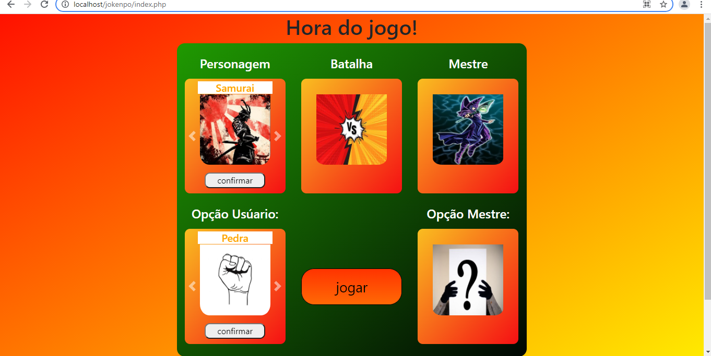
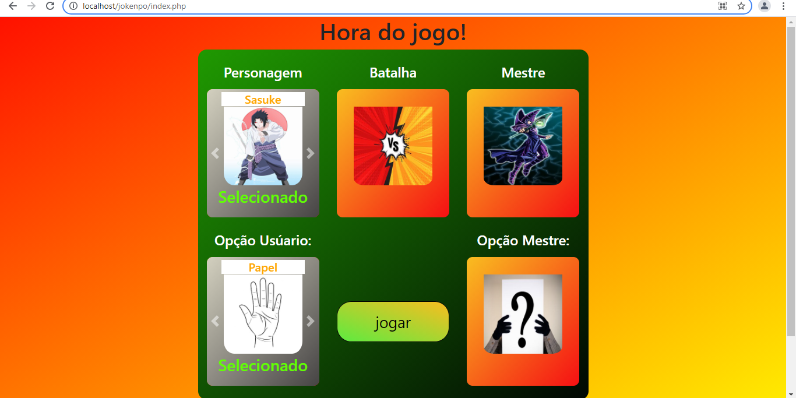
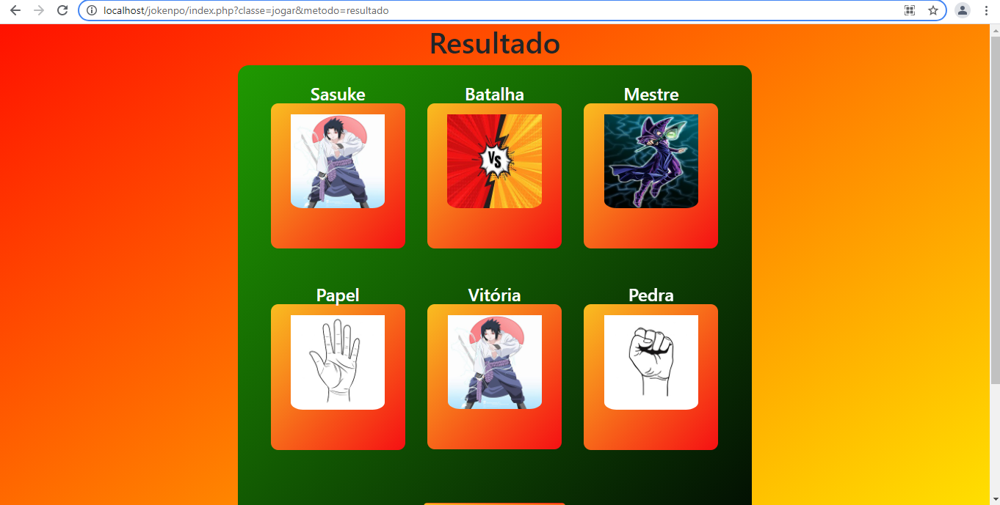
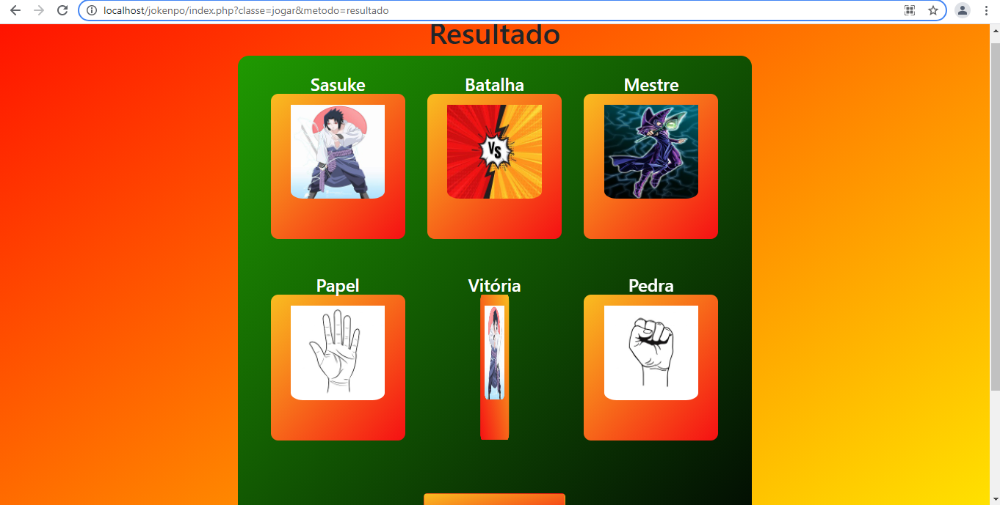
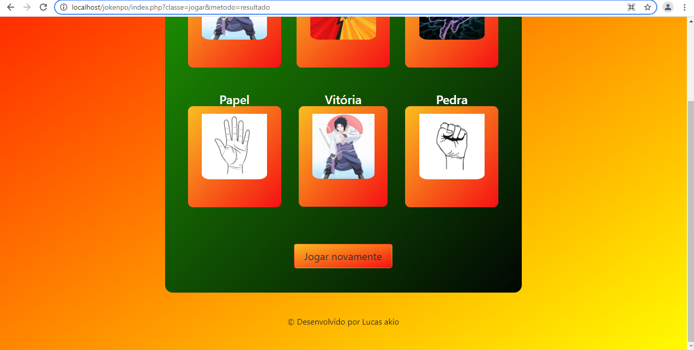

# Projeto desenvolvido com PHP e JavaScript :heart_eyes: :collision: JOKENPÔ :facepunch: :hand: :v: :boom: :trophy:

## veja como está esse projeto divertido

## :warning: Atenção: se você é competitivo, nesse jogo você tem 0,33% de chance de ganhar então é melhor não jogar apostado viu :joy::joy::joy::joy: :fearful: 
### :camera: imagem da página home:

 
 
### :camera: imagem de escolha do personagem:

 
### :camera: imagem do resultado parte 1:

### :camera: imagem do resultado parte 2, perceba que o vencedor tem um efeito, ele fica girando infinitamente chamando bastante atenção:

### :camera: por último a imagem mostrando o restante da página com um botão de jogar novamente :+1: :grin:

 

